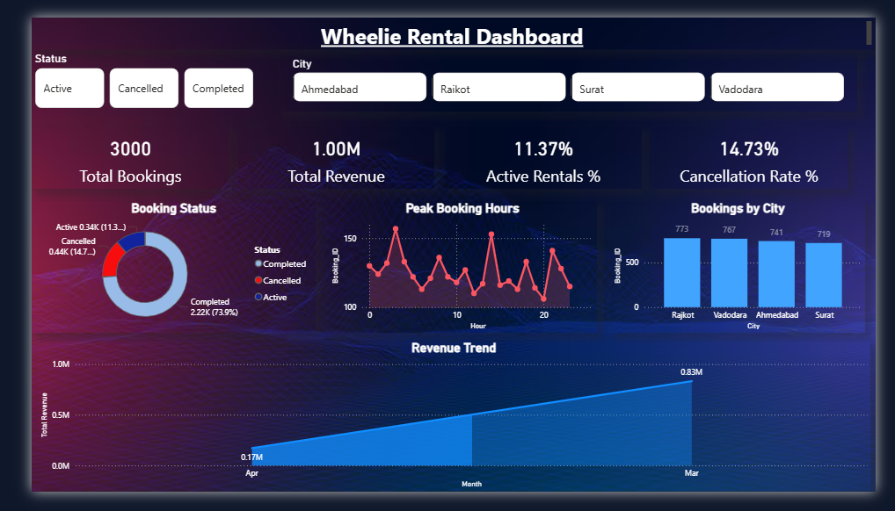

# Wheelie Rental Dashboard

## 📊 Overview
This project is a Power BI dashboard that analyzes rental bookings, revenue, and customer behavior.

## 🔧 Tools Used
- Power BI
- Excel

## 📈 Key Features
- Total Bookings and Revenue KPIs
- Active Rentals and Cancellation Rate
- City-wise booking analysis
- Peak booking hours visualization

## 📌 Insights
- Identified high-demand cities
- Analyzed peak usage time for rentals

## 📷 Dashboard Preview
## 📷 Dashboard Preview  

